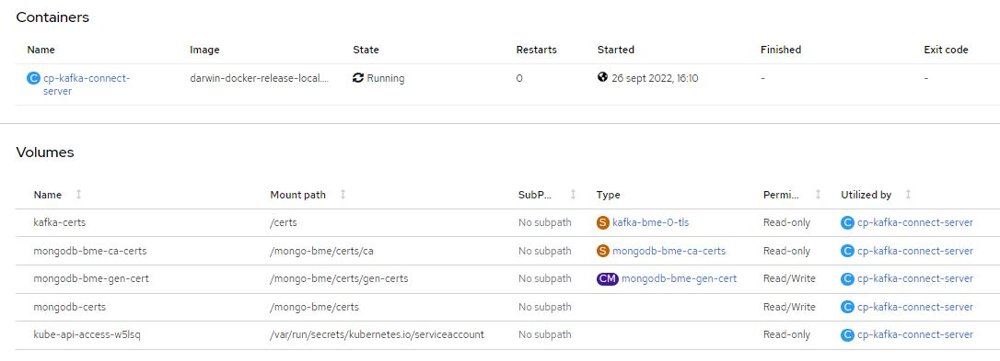

# Kafka Connect

Apache Kafka es una plataforma distribuida de transmisión de datos que permite publicar, almacenar y procesar flujos de registros, así como suscribirse a ellos, de forma inmediata. Está diseñada para administrar los flujos de datos de varias fuentes y distribuirlos a diversos usuarios.

### Requerimientos

- [Cluster Openshift 4]
- [Helm 3]
- [Confluent chart repository]
- [Confluent image repository]

>**NOTA:** Release Confluent Chart cp-kafka-connect tag: 6.1.0

>**NOTA:** Release Confluent Image cp-kafka-connect: confluentinc/cp-kafka-connect-plugin, tag: 6.1.0

### Resumen

Documentaremos la mejor forma de configurar en el Cluster de Kafka, Kafka-connect y como conectarlo con TLS a **Kafka** y a **MongoDB**.

Para llevar esto a acabo, usaremos un proveedor externo, y oficial, de imagenes y plantillas helm, concretamente [Confluent]

### TLS

#### MongoDB
La mejor forma de configurar kafka-connect y conectarlo al cluster de MongoDB con TLS.

Para poder conectar kafka-connecto con MongoDB y TLS, es necesario dotar al elemento de los certificados necesarios. Para ello, debemos incluir la certification authority (CA) de MongoDB, y un script para poder generar el certificado del servidor.

- Certification authority (CA) de MongoDB: [mongodb-bme-ca-certs.yaml](../kafka-obj-repository/para%20kafka-connect/mongodb-bme-ca-certs.yaml)
- Script de generación de certificado: [kafka-connect-gencerts-to-mongodb-bme.yaml](../kafka-obj-repository/para%20kafka-connect/kafka-connect-gencerts-to-mongodb-bme.yaml)

Estos elementos deben de estar dentro del Cluster, para ello ejecutamos:

```shell
$ kubectl apply -f mongodb-bme-ca-certs.yaml
$ kubectl apply -f kafka-connect-gencerts-to-mongodb-bme.yaml
```

Y seran incluidos como volumenes del elemento:



Los incluiremos como volumes y volumeMounts, dentro del values.yaml:

```yaml
volumeMounts:
  - name: kafka-certs
    readOnly: true
    mountPath: /certs
  - name: mongodb-bme-ca-certs
    readOnly: true
    mountPath: /mongo-bme/certs/ca
  - name: mongodb-bme-gen-cert
    mountPath: /mongo-bme/certs/gen-certs
  - name: mongodb-certs
    mountPath: /mongo-bme/certs

volumes:
  - name: kafka-certs
    secret:
      secretName: kafka-bme-0-tls
      defaultMode: 256
  - name: mongodb-bme-ca-certs
    secret:
      secretName: mongodb-bme-ca-certs
      defaultMode: 256
  - name: mongodb-bme-gen-cert
    configMap:
      name: mongodb-bme-gen-cert
      defaultMode: 0777
  - name: mongodb-certs
    emptyDir: {}
```
Otra cosa que debemos configurar, una vez que tenemos los volumenes para el elemento, son los environments necesarios para configurar el acceso a MongoDB, detallemoslo:

- KAFKA_OPTS: indica a la aplicación java donde esta el TrustStore y KeyStore y su password.
- CUSTOM_SCRIPT_PATH: nos permite ejecutar un script en el arranque de Kafka Connect. Ejecutara la generación del certificado
- MONGODB_MONGOS_X: indica los nombres de los elementos frontal dentro de MongoDB.

```yaml
customEnv:
  KAFKA_OPTS: "-Djavax.net.ssl.trustStore=/mongo-bme/certs/mongoStore.ts -Djavax.net.ssl.trustStorePassword=changeit -Djavax.net.ssl.keyStore=/mongo-bme/certs/mongodb.jks -Djavax.net.ssl.keyStorePassword=changeit"
  CUSTOM_SCRIPT_PATH: /mongo-bme/certs/gen-certs/cert_setup.sh
  MONGODB_MONGOS_0: mongodb-sharded-bme-mongos-575c69f799-k2nnx
  MONGODB_MONGOS_1: mongodb-sharded-bme-mongos-575c69f799-5dt4j
```

#### Kafka

La mejor forma de configurar kafka-connect y conectarlo al cluster de kafka con TLS.

Para poder conectar kafka-connecto con kafka y TLS, es necesario dotar al elemento de los certificados necesarios. Para ello, debemos incluir el certificado del Broker-0 de kafka.

Y seran incluidos como volumenes del elemento:


Los incluiremos como volumes y volumeMounts, dentro del values.yaml:

```yaml
volumeMounts:
  - name: kafka-certs
    readOnly: true
    mountPath: /certs
  - name: mongodb-bme-ca-certs
    readOnly: true
    mountPath: /mongo-bme/certs/ca
  - name: mongodb-bme-gen-cert
    mountPath: /mongo-bme/certs/gen-certs
  - name: mongodb-certs
    mountPath: /mongo-bme/certs

volumes:
  - name: kafka-certs
    secret:
      secretName: kafka-bme-0-tls
      defaultMode: 256
  - name: mongodb-bme-ca-certs
    secret:
      secretName: mongodb-bme-ca-certs
      defaultMode: 256
  - name: mongodb-bme-gen-cert
    configMap:
      name: mongodb-bme-gen-cert
      defaultMode: 0777
  - name: mongodb-certs
    emptyDir: {}
```
Otra cosa que debemos configurar, una vez que tenemos los volumenes para el elemento, son los environments necesarios para configurar el acceso al Cluster de Kafka:

```yaml

configurationOverrides:
  ...
  "security.protocol": "SSL"
  "ssl.truststore.type": "PEM"
  "ssl.truststore.location": "/certs/ca.crt"
  "consumer.security.protocol": "SSL"
  "consumer.ssl.truststore.type": "PEM"
  "consumer.ssl.truststore.location": "/certs/ca.crt"
  "consumer.log4j.root.loglevel": "DEBUG"
  "producer.security.protocol": "SSL"
  "producer.ssl.truststore.type": "PEM"
  "producer.ssl.truststore.location": "/certs/ca.crt"
  "producer.log4j.root.loglevel": "DEBUG"
  "bootstrap.servers": "kafka-bme.dclear-kafka-dev:9092"
  "consumer.bootstrap.servers": "kafka-bme.dclear-kafka-dev:9092"
  "producer.bootstrap.servers": "kafka-bme.dclear-kafka-dev:9092"
```

### Helm

Helm (del término marítimo de timón) es una herramienta para gestionar aplicaciones de Kubernetes. Helm te ayuda a timonear Kubernetes usando cartas de navegación, que en inglés se conocen como Helm Charts.

Helm se autodefine como «the package manager for Kubernetes», que en español se traduce como el administrador de paquetes para Kubernetes. Es decir, se trata de un sistema que cuenta con una alta potencia y que contiene plantillas para manifiestos de la plataforma de Kubernetes.

Además de esto, Helm se incluye como un proyecto de tipo oficial del sistema de Kubernetes, también conocida como K8s.

>**NOTA:** Previo a la instalación debemos [conectarnos al cluster de Openshift 4]

#### Install Confluent helm repository

```shell
$ git clone https://github.com/confluentinc/cp-helm-charts.git
$ helm install cp-helm-charts
```

#### Deploy

Values de deploy:
[kafka-connect-bme-values.yaml](../kafka-obj-repository/kafka-connect-bme-values.yaml)

Comando de deploy:

```shell
$ helm upgrade --install kafka-connect-bme cp-helm-charts/charts/cp-kafka-connect -f kafka-connect-bme-values.yaml
```


<-- [back to Kafka]

[UI for Kafka] -->


[back to Kafka]: ../Readme.md
[UI for Kafka]: ../UI-for-kafka/Readme.md
[Cluster Openshift 4]: (https://docs.openshift.com/container-platform/4.6/welcome/index.html)
[Helm 3]: (https://helm.sh/)
[Confluent]: (https://confluent.io/)
[Confluent chart repository]: (https://github.com/confluentinc/cp-helm-charts)
[Confluent image repository]: (https://hub.docker.com/u/confluentinc)
[conectarnos al cluster de Openshift 4]: ../opc4-connect.md