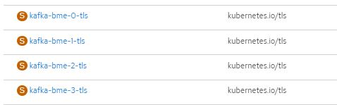
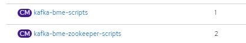
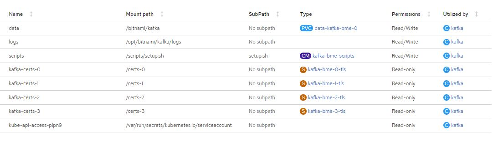

# Kakfa

Apache Kafka es una plataforma distribuida de transmisión de datos que permite publicar, almacenar y procesar flujos de registros, así como suscribirse a ellos, de forma inmediata. Está diseñada para administrar los flujos de datos de varias fuentes y distribuirlos a diversos usuarios. En pocas palabras, transfiere cantidades enormes de datos, no solo desde el punto A hasta el B, sino también del punto A al Z y a cualquier otro lugar que necesite, y todo al mismo tiempo.

Apache Kafka es la alternativa a un sistema de mensajería tradicional para empresas. Comenzó como un sistema interno que LinkedIn desarrolló para gestionar 1,4 billones de mensajes por día. Ahora, es una solución open source de transmisión de datos que permite satisfacer diversas necesidades empresariales.

### Requerimientos

 - [Cluster Openshift 4]
 - [Helm 3]
 - [Bitnami chart repository]
 - [Bitnami image repository]
 
>**NOTA:** Release Bitnami Chart kafka tag: 18.4.3

>**NOTA:** Release Bitnami Image Kafka: bitnami/kafka, tag: 3.2.1-debian-11-r4

>**NOTA:** Release Bitnami Image Zookeper: bitnami/zookeeper, tag: 3.8.0-debian-11-r30


### Resumen

Documentaremos la mejor forma de configurar un Cluster de Kafka con TLS.

Para llevar esto a acabo, usaremos un proveedor externo de imagenes y plantillas helm, concretamente [Bitnami]

### TLS

La mejor forma de configurar un cluster con TLS, con el Chart de Bitnami y sus imagenes, es marcar los atributos para que se genere de forma automatica:

```yaml
## Authentication parameters
## https://github.com/bitnami/containers/tree/main/bitnami/kafka#security
##
auth:
  clientProtocol: tls
  externalClientProtocol: tls
  interBrokerProtocol: tls
  ## TLS configuration
  ##
  tls:
    ## @param auth.tls.type Format to use for TLS certificates. Allowed types: `jks` and `pem`
    ##
    type: pem
    ## @param auth.tls.pemChainIncluded Flag to denote that the Certificate Authority (CA) certificates are bundled with the endpoint cert.
    ## Certificates must be in proper order, where the top certificate is the leaf and the bottom certificate is the top-most intermediate CA.
    ##
    pemChainIncluded: false
    # existingSecrets: [kafka-tls-jks-v6-0, kafka-tls-jks-v6-1, kafka-tls-jks-v6-2, kafka-tls-jks-v6-3]
    #existingSecrets: []
    existingSecrets: []
    ## @param auth.tls.autoGenerated Generate automatically self-signed TLS certificates for Kafka brokers. Currently only supported if `auth.tls.type` is `pem`
    ## Note: ignored when using 'jks' format or `auth.tls.existingSecrets` is not empty
    ##
    autoGenerated: true
    ## @param auth.tls.password Password to access the JKS files or PEM key when they are password-protected.
    ## Note: ignored when using 'existingSecret'.
    ##
    password: ""
    ## @param auth.tls.existingSecret Name of the secret containing the password to access the JKS files or PEM key when they are password-protected. (`key`: `password`)
    ##
    existingSecret: ""
    ## @param auth.tls.jksTruststoreSecret Name of the existing secret containing your truststore if truststore not existing or different from the ones in the `auth.tls.existingSecrets`
    ## Note: ignored when using 'pem' format for certificates.
    ##
    jksTruststoreSecret: ""
    ## @param auth.tls.jksKeystoreSAN The secret key from the `auth.tls.existingSecrets` containing the keystore with a SAN certificate
    ## The SAN certificate in it should be issued with Subject Alternative Names for all headless services:
    ##  - kafka-0.kafka-headless.kafka.svc.cluster.local
    ##  - kafka-1.kafka-headless.kafka.svc.cluster.local
    ##  - kafka-2.kafka-headless.kafka.svc.cluster.local
    ## Note: ignored when using 'pem' format for certificates.
    ##
    jksKeystoreSAN: ""
    ## @param auth.tls.jksTruststore The secret key from the `auth.tls.existingSecrets` or `auth.tls.jksTruststoreSecret` containing the truststore
    ## Note: ignored when using 'pem' format for certificates.
    ##
    jksTruststore: ""
    ## @param auth.tls.endpointIdentificationAlgorithm The endpoint identification algorithm to validate server hostname using server certificate
    ## Disable server host name verification by setting it to an empty string.
    ## ref: https://docs.confluent.io/current/kafka/authentication_ssl.html#optional-settings
    ##
    endpointIdentificationAlgorithm: https
```

Al marcar este atributo como `autoGenerated: true`, el mismo deploy siguiendo su plantilla nos proveera de los elementos necesarios para configurar el TLS, como los certificados y la forma de autogenerarlos:



Ademas de los certificados crea otra serie de objetos/elementos que son necesarios para la auto generación de cretificados:



Cuando crea los elementos, la misma plantilla de Bitnami, se encarga de agregar estos elementos dentro de los pods, para poder proceder a la autoconfiguración del TLS:



De esta manera logra comunicar los nodos del cluster.

### Helm 

Helm (del término marítimo de timón) es una herramienta para gestionar aplicaciones de Kubernetes. Helm te ayuda a timonear Kubernetes usando cartas de navegación, que en inglés se conocen como Helm Charts.

Helm se autodefine como «the package manager for Kubernetes», que en español se traduce como el administrador de paquetes para Kubernetes. Es decir, se trata de un sistema que cuenta con una alta potencia y que contiene plantillas para manifiestos de la plataforma de Kubernetes.

Además de esto, Helm se incluye como un proyecto de tipo oficial del sistema de Kubernetes, también conocida como K8s.

>**NOTA:** Previo a la instalación debemos [conectarnos al cluster de Openshift 4]

#### Install bitnami helm repository

```shell
$ helm repo add bitnami https://charts.bitnami.com/bitnami
```

#### Deploy

Values de deploy:
[kafka-bme-values.yaml](./kafka-obj-repository/kafka-bme-values.yaml)

Comando de deploy:

```shell
$ helm upgrade --install kafka-bme bitnami/kafka -f kafka-bme-values.yaml
```

### Elementos dentro del cluster de kafka:

1. [Schema registry](Schema-registry/Readme.md)
2. [kafka-connect](Kafka-connect/Readme.md)
3. [kafka-ui](UI-for-kafka/Readme.md)


<-- [back]


[back]: ../Readme.md
[Cluster Openshift 4]: (https://docs.openshift.com/container-platform/4.6/welcome/index.html)
[Helm 3]: (https://helm.sh/)
[Bitnami]: (https://bitnami.com/)
[Bitnami chart repository]: (https://github.com/bitnami/charts)
[Bitnami image repository]: (https://github.com/bitnami/containers)
[conectarnos al cluster de Openshift 4]: ./opc4-connect.md