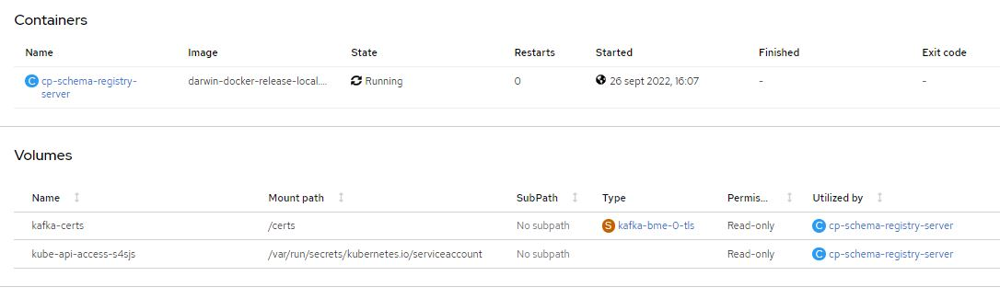

# Schema registry

El Schema Registry es un componente independiente de Kafka que tiene los siguientes objetivos: 
 - Distribuir los esquemas al productor y consumidor almacenando una copia. 
 - Forzar el cumplimiento del contrato definido en el esquema entre los productores y consumidores del topic de Kafka.

### Requerimientos

- [Cluster Openshift 4]
- [Helm 3]
- [Confluent chart repository]
- [Confluent image repository]

>**NOTA:** Release Confluent Chart cp-schema-registry tag: 6.1.0

>**NOTA:** Release Confluent Image cp-schema-registry: confluentinc/cp-schema-registry, tag: 7.0.5


### Resumen

Documentaremos la mejor forma de configurar dentro del Cluster `Schema-Registry` y como conectarlo a Kafka con TLS.

Para llevar esto a acabo, usaremos un proveedor externo, y oficial, de imagenes y plantillas helm, concretamente [Confluent]

### TLS

La mejor forma de configurar Schema-Registry y conectarlo al cluster de kafka con TLS.

Para ello debemos de modificar la plantilla `deployment.yaml` dentro del **Chart cp-schema-registry de Confluent**. El motivo es, que dicho chart no permite incluir volumenes extra dentro del elemento. Por lo que, debemos modificar la plantilla añadiendo `volumes` y `volumeMounts`.

Descarguemonos el Chart de Confluent:

```shell
$ git clone https://github.com/confluentinc/cp-helm-charts.git
```

Ejemplo [deployment.yaml]:

```yaml
 > lineas de la 108 a la 118 del deployment.yaml

   {{- if .Values.volumeMounts }}
   volumeMounts:
 {{ toYaml .Values.volumeMounts | indent 10 }}
   {{- end}}
   {{- if .Values.imagePullSecrets }}
 imagePullSecrets:
   {{ toYaml .Values.imagePullSecrets | indent 8 }}
   {{- end }}
 volumes:
   {{- if .Values.volumes }}
   {{ toYaml .Values.volumes | trim | indent 6 }}
   {{- end}}
```
Esto nos permitira introducir estos atributos dentro del values para poder conectar **_schema-registry_** con **kafka** por TLS:

[kafka-schema-registry-bme-values.yaml]:

```yaml
volumeMounts:
  - name: kafka-certs
    readOnly: true
    mountPath: /certs
    
volumes:
  - name: kafka-certs
    secret:
      secretName: kafka-bme-0-tls
      defaultMode: 256
```
Lo que estamos es insertando el certificado del broker-0 dentro de `schema-registry` y de esta manera lograr comunicarlo con los nodos del cluster.

Para que schema-regsitry configure el TLS, debemos de indicarle los environment necesarios:

```yaml
## Additional env variables
customEnv: 
  SCHEMA_REGISTRY_DEBUG: true
  SCHEMA_REGISTRY_KAFKASTORE_SECURITY_PROTOCOL: SSL
  SCHEMA_REGISTRY_KAFKASTORE_SSL_TRUSTSTORE_TYPE: PEM
  SCHEMA_REGISTRY_KAFKASTORE_SSL_TRUSTSTORE_LOCATION: /certs/ca.crt
```



### Helm

Helm (del término marítimo de timón) es una herramienta para gestionar aplicaciones de Kubernetes. Helm te ayuda a timonear Kubernetes usando cartas de navegación, que en inglés se conocen como Helm Charts.

Helm se autodefine como «the package manager for Kubernetes», que en español se traduce como el administrador de paquetes para Kubernetes. Es decir, se trata de un sistema que cuenta con una alta potencia y que contiene plantillas para manifiestos de la plataforma de Kubernetes.

Además de esto, Helm se incluye como un proyecto de tipo oficial del sistema de Kubernetes, también conocida como K8s.

>**NOTA:** Previo a la instalación debemos [conectarnos al cluster de Openshift 4]

#### Install Confluent helm repository

Como hemos modificado la plantilla del deployment del cp-schema-registry del Chart de Confluent, deberemos ejecutar desde el diretorio del Chart cp-schema-registry.

Por lo que no necesitamos instalación, solo descargarnos el Chart, que ya hemos realizado.


#### Deploy

Values de deploy:
[kafka-schema-registry-bme-values.yaml](../kafka-obj-repository/kafka-schema-registry-bme-values.yaml)

Para ejecutar el deploy, deberemos acceder a la carpeta cp-scheme-registy y ejecutar desde ahí:

```shell
$
$ cd cp-helm-charts
$
$ cd charts
$
$ cd cp-scheme-registry
$
$ helm upgrade --install kafka-schema-registry . -f kafka-schema-registry-bme-values.yaml
```

<-- [back to Kafka]

[Kafka-connect] -->


[back to Kafka]: ../Readme.md
[Kafka-connect]: ../Kafka-connect/Readme.md
[Cluster Openshift 4]: (https://docs.openshift.com/container-platform/4.6/welcome/index.html)
[Helm 3]: (https://helm.sh/)
[Confluent]: (https://www.confluent.io/)
[Confluent chart repository]: (https://github.com/confluentinc/cp-helm-charts)
[Confluent image repository]: (https://hub.docker.com/u/confluentinc)
[conectarnos al cluster de Openshift 4]: ../opc4-connect.md
[deploy de Kafka]: ../Readme.md#deploy
[deployment.yaml]: ../kafka-obj-repository/para%20schema-registry/deployment.yaml
[kafka-schema-registry-bme-values.yaml]: ../kafka-obj-repository/kafka-schema-registry-bme-values.yaml