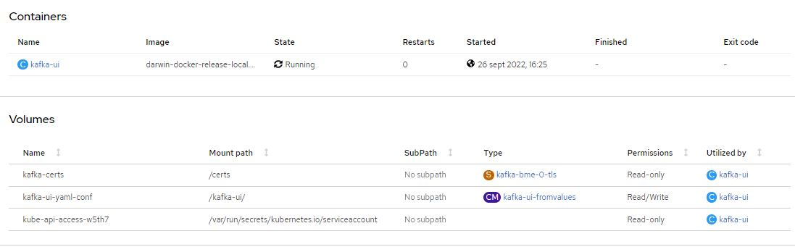

# UI for Kafka

Interfaz de usuario web versátil, rápida y liviana para administrar clústeres de Apache Kafka®. Creado por desarrolladores, para desarrolladores.

### Requerimientos

- [Cluster Openshift 4]
- [Helm 3]
- [Provectus chart repository]
- [Provectus image repository]

>**NOTA:** Release Provectus Chart kafka-ui tag: 0.4.0

>**NOTA:** Release Provectus Image kafka-ui: provectuslabs/kafka-ui, tag: 0.4.0 = 1.0.0 (artifactory)

### Resumen

Documentaremos la mejor forma de configurar en el Cluster de Kafka, Kafka-ui y como conectarlo con TLS a **Kafka**.

Para llevar esto a acabo, usaremos un proveedor externo de imagenes y plantillas helm, concretamente [Provectus]

### TLS

La mejor forma de configurar kafka-ui y conectarlo al cluster de kafka con TLS.

Para poder conectar kafka-ui con kafka y TLS, es necesario dotar al elemento de los certificados necesarios. Para ello, debemos incluir el certificado del Broker-0 de kafka.

Y seran incluidos como volumenes del elemento:



Los incluiremos como volumes y volumeMounts, dentro del values.yaml:

```yaml
volumeMounts: 
  - name: kafka-certs
    readOnly: true
    mountPath: /certs

volumes:
  - name: kafka-certs
    secret:
      secretName: kafka-bme-0-tls
      defaultMode: 256
```
Otra cosa que debemos configurar, una vez que tenemos los volumenes para el elemento, son los environments necesarios para configurar el acceso al Cluster de Kafka:

```yaml

yamlApplicationConfig:
  kafka:
    clusters:
      - name: kafka-bme
        bootstrapServers: kafka-bme.dclear-kafka-dev:9092
        schemaRegistry: http://kafka-schema-registry-cp-schema-registry:8081
        kafkaConnect:
          - name: kafka-connect-bme
            address: http://kafka-connect-bme-cp-kafka-connect:8083
        properties:
          security.protocol: SSL
          ssl:
            truststore.type: PEM
            truststore.location: /certs/ca.crt
```
Esto nos creara un fichero de configuración en **/kafka-ui/config.yml**.

### Helm

Helm (del término marítimo de timón) es una herramienta para gestionar aplicaciones de Kubernetes. Helm te ayuda a timonear Kubernetes usando cartas de navegación, que en inglés se conocen como Helm Charts.

Helm se autodefine como «the package manager for Kubernetes», que en español se traduce como el administrador de paquetes para Kubernetes. Es decir, se trata de un sistema que cuenta con una alta potencia y que contiene plantillas para manifiestos de la plataforma de Kubernetes.

Además de esto, Helm se incluye como un proyecto de tipo oficial del sistema de Kubernetes, también conocida como K8s.

>**NOTA:** Previo a la instalación debemos [conectarnos al cluster de Openshift 4]

#### Install Confluent helm repository

```shell
$ helm repo add kafka-ui https://provectus.github.io/kafka-ui
```

#### Deploy

Values de deploy:
[kafka-ui-bme-values.yaml](../kafka-obj-repository/kafka-ui-bme-values.yaml)

Comando de deploy:

```shell
$ helm upgrade --install kafka-ui kafka-ui/kafka-ui -f kafka-ui-bme-values.yaml
```


<-- [back to Kafka]

[Schema Registry] -->


[back to Kafka]: ../Readme.md
[Schema Registry]: ../Schema-registry/Readme.md
[Cluster Openshift 4]: (https://docs.openshift.com/container-platform/4.6/welcome/index.html)
[Helm 3]: (https://helm.sh/)
[Provectus]: (https://provectus.com/professional-services-apache-kafka/)
[Provectus chart repository]: (https://github.com/provectus/kafka-ui/tree/master/charts/kafka-ui)
[Provectus image repository]: (https://hub.docker.com/r/provectuslabs/kafka-ui)
[conectarnos al cluster de Openshift 4]: ../opc4-connect.md
