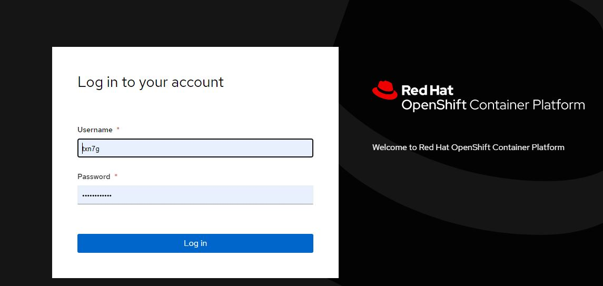
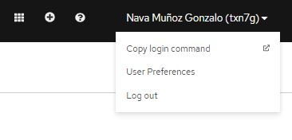
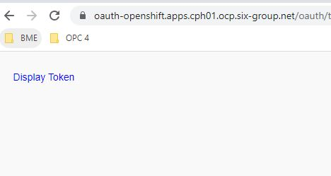
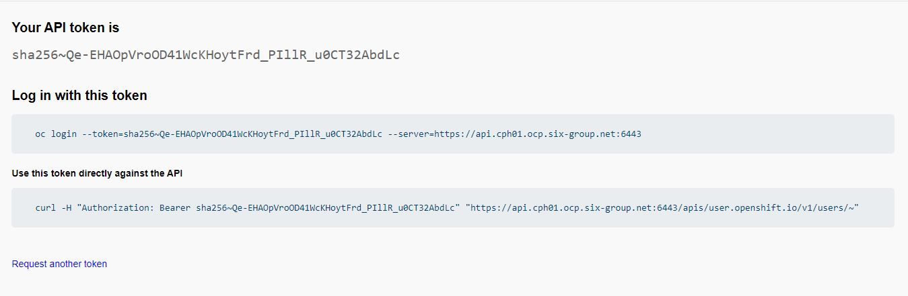

# Conectar a Openshift 4

Uri Openshift 4: https://console-openshift-console.apps.cph01.ocp.six-group.net/

## oc client

Interfaz de linea de comandos de Openshift Platform, permite interactuar con Openshift y realizar todas las tareas de gestió necesarias.

### Descargar e instalar [oc CLI]

Accedemos a la pagina de Openshift 4 y nos logamos:



Una vez logado clicamos en nuestro nombre y pulsamos sobre `Copy login commando`:



Esto nos trasladará a una pagina donde podremos copiar el comando de login con `oc CLI`



Pulsamos y copiamos el primer comando, para ejecutarlo en nuestro terminal:



```shell
$ oc login --token=sha256~Qe-EHAOpVroOD41WcKHoytFrd_PIllR_u0CT32AbdLc --server=https://api.cph01.ocp.six-group.net:6443
```


[oc CLI]: https://docs.openshift.com/container-platform/4.7/cli_reference/openshift_cli/getting-started-cli.html

