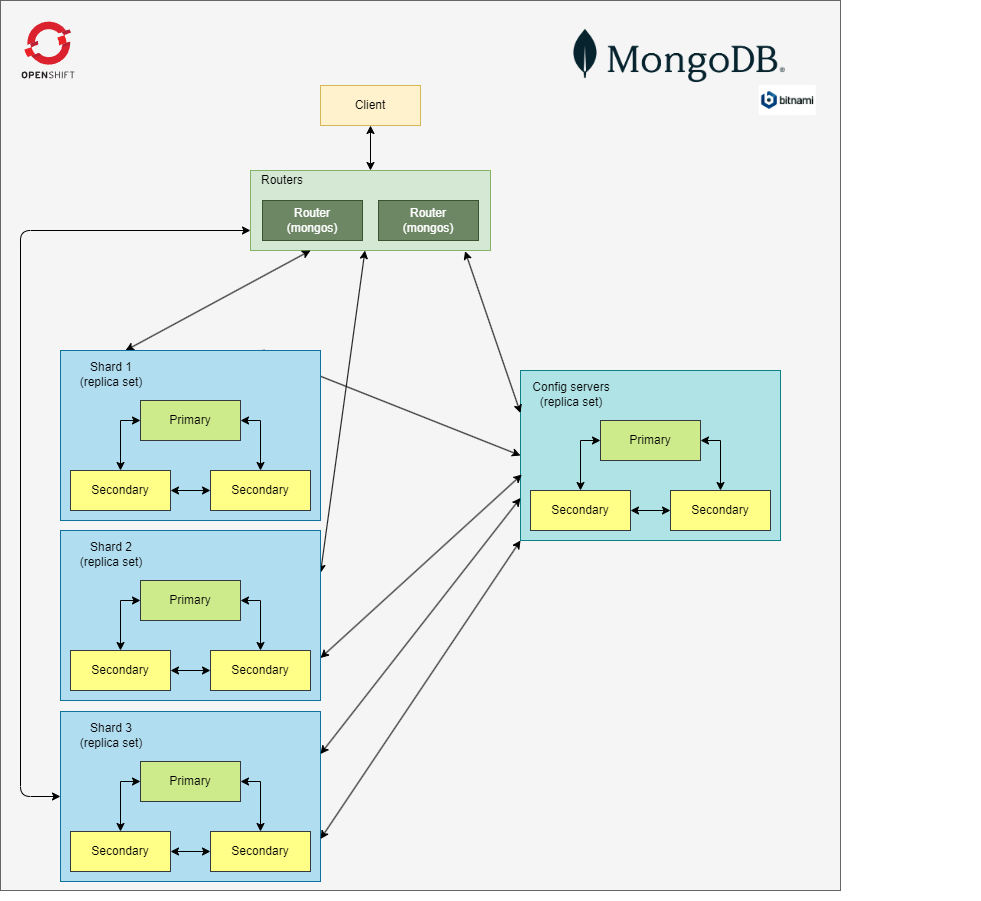

# MongoDB Sharded


MongoDB(R) is an open source NoSQL database that uses JSON for data storage. MongoDB(TM) Sharded improves scalability and reliability for large datasets by distributing data across multiple machines.

[MongoDB official website](https://www.mongodb.com/)

## 1. Deployment
We have used the bitnami version. The helm charts are those maintained by SIX.

[Original bitnami repo](https://github.com/bitnami/charts/tree/master/bitnami/mongodb-sharded)

```sh
helm repo add bitnami-six https://artifactory.six-group.net/artifactory/ocp-helm-virtual/
helm repo update
```

- MongoDB cluster schema


La imagen de bitnami sobre la que se ha trabajado es: [bitnami/mongodb-sharded:6.0.1-debian-11-r8](https://hub.docker.com/layers/bitnami/mongodb-sharded/6.0.1-debian-11-r8/images/sha256-91188bf610914c0fce38d39a760f71e9c32d36a4f10866ce427524c34c1668a6?context=explore)

Pero debido a que bitnami no contempla en sus charts la configuración del TLS en el clúster, se ha tenido que realizar ciertas modificaciones en la imagen de bitnami.

Esto nos ha obligado a crearnos nuestra propia imagen docker basandonos en la existente de bitnami.

Nuestro [Dockerfile](./mongodb/docker-image/Dockerfile) es el siguiente

#### Dockerfile
```docker
FROM bitnami/mongodb-sharded:6.0.1-debian-11-r8

USER root

COPY ./entrypoint.sh /entrypoint.sh
COPY ./mongodb.conf /opt/bitnami/mongodb/conf/mongodb.conf
COPY ./mongos.conf /opt/bitnami/mongodb/conf/mongos.conf
COPY ./cert_setup.sh /cert_setup.sh

RUN chmod 777 /entrypoint.sh /opt/bitnami/mongodb/conf/mongodb.conf /opt/bitnami/mongodb/conf/mongos.conf /cert_setup.sh
```

La parte importante de la imagen es que sobrescribimos los ficheros de configuración tanto para los nodos mongos, como para los nodos mongod (Config server y Shards) e inyectamos el script de generación de los certificados para que se haga de manera dinamica. 

##### Config

En los ficheros de configuración se ha tenido que añadir la parte del TLS
```yml
# network ssl
net:
  tls:
    mode: requireTLS
    certificateKeyFile: /opt/bitnami/certs/mongodb.pem
    clusterFile: /opt/bitnami/certs/mongodb.pem
    CAFile: /opt/bitnami/ca-certs/CA.pem
```
[mongodb.conf](./mongodb/docker-image/mongodb.conf)
[mongos.conf](./mongodb/docker-image/mongos.conf)

>**NOTA:** Aquí se podría realizar una refactorización que mejorase el proceso. Existe algún dato en el script directamente introducido en el código

##### Scripts

[cert_setup.sh](./mongodb/docker-image/cert_setup.sh)
[entrypoint.sh](./mongodb/docker-image/entrypoint.sh)